<!-- Nithushan Uthayarasa · GitHub profile -->

**AI/ML Undergraduate · Aspiring AI/ML Engineer**

I build practical AI systems that connect strong models with useful, reliable software.

## About me

I'm a **third-year BSc (Hons) Information Technology undergraduate specializing in Artificial Intelligence at SLIIT**, based in **Jaffna, Sri Lanka**. I enjoy the complete engineering path: preparing data, comparing models, evaluating retrieval quality, building APIs, and turning experiments into usable applications.

I'm looking for an **AI/ML Engineering Internship** where I can contribute to real products and learn from experienced engineers.

## Technical expertise

| Area | What I work with |
| :--- | :--- |
| **Applied ML & deep learning** | Classification, transfer learning, NLP, computer vision, preprocessing, cross-validation, model evaluation |
| **Retrieval & generative AI** | RAG, LLMs, Gemini, embeddings, vector databases, BM25, TF-IDF, reciprocal rank fusion, LangGraph, LangChain Core |
| **Product engineering** | Python services and APIs, full-stack applications, mobile interfaces, relational and document databases |

## Technology stack

**Programming** 

**AI & machine learning** 

 Machine learning · Deep learning · NLP · Computer vision

**Generative AI & retrieval** 

 RAG · LLMs · LangChain Core · Vector embeddings · Vector databases

**Backend** 

**Frontend & mobile** 

**Data & retrieval** 

 BM25 and TF-IDF are retrieval methods, so they are listed by name rather than given unrelated logos.

**Developer tools** 

## Featured AI/ML projects

<table>
  <tr>
    <td width="50%" valign="top">
      <h3>01 · ContextIQ</h3>
      
<strong>RAG-powered intelligence system</strong>

      
Multi-document RAG with Gemini embeddings, ChromaDB, hybrid BM25 + vector retrieval, RRF, TF-IDF reranking, parent-child chunking, context compression, page citations, a retrieval inspector, and quantitative evaluation.

      
<code>Python</code> <code>Gemini</code> <code>ChromaDB</code> <code>Streamlit</code>

      
      
    </td>
    <td width="50%" valign="top">
      <h3>02 · Manufacturing Inventory Coordinator</h3>
      
<strong>Multi-agent manufacturing platform</strong>

      
Team-built full-stack system with a LangGraph workflow, validation and safety agent, inventory recommendations, defect management, quarantine workflows, and audit history.

      
<code>LangGraph</code> <code>FastAPI</code> <code>ASP.NET Core</code> <code>PostgreSQL</code>

      
    </td>
  </tr>
  <tr>
    <td width="50%" valign="top">
      <h3>03 · Garbage Image Classification</h3>
      
<strong>Computer vision for waste sorting</strong>

      
CNN transfer learning system trained on over 20,000 images across 10 waste categories. Includes preprocessing, augmentation, and model evaluation; achieved <strong>88.6% test accuracy</strong>.

      
<code>Deep learning</code> <code>CNN</code> <code>Computer vision</code>

      
    </td>
    <td width="50%" valign="top">
      <h3>04 · Cyber Threats & Financial Loss Prediction</h3>
      
<strong>Comparative machine learning pipeline</strong>

      
Compared Random Forest, CatBoost, XGBoost, LightGBM, and Extra Trees with hyperparameter tuning, cross-validation, evaluation metrics, and model selection.

      
<code>Machine learning</code> <code>Model comparison</code> <code>Evaluation</code>

      
    </td>
  </tr>
</table>

## GitHub analytics

  
  

## Contribution streak

  

## Contribution trail

  <picture>
    <source media="(prefers-color-scheme: dark)" srcset="https://raw.githubusercontent.com/NithushanUthayarasa/NithushanUthayarasa/output/github-snake-dark.svg" />
    <source media="(prefers-color-scheme: light)" srcset="https://raw.githubusercontent.com/NithushanUthayarasa/NithushanUthayarasa/output/github-snake.svg" />
    
  </picture>

## Current technical interests

- Making RAG systems more measurable, grounded, and transparent.
- Combining retrieval strategies and evaluating where each one helps.
- Applying computer vision and machine learning to useful real-world workflows.
- Shipping AI features through dependable APIs and clear user interfaces.

## Let's connect

I'm open to **AI/ML engineering internship opportunities**, collaborative projects, and conversations about applied AI.

<!-- LinkedIn link will be added when the correct profile URL is provided. -->

