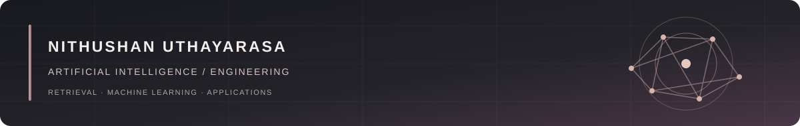

# Nithushan Uthayarasa

**AI/ML undergraduate · Applied AI and software engineering** 
Third-year BSc (Hons) Information Technology student, specializing in Artificial Intelligence at SLIIT. Based in Jaffna, Sri Lanka.

I build retrieval systems, machine learning models, and AI-enabled applications. My work connects model design with evaluation, APIs, and interfaces people can use. I am seeking an **AI/ML Engineering Internship**.

[Portfolio](https://nithushan-portfolio.vercel.app/) · [Résumé](https://nithushan-portfolio.vercel.app/CV_Nithushan_Uthayarasa.pdf) · [LinkedIn](https://www.linkedin.com/in/nithushan-uthayarasa-6a4819377/) · [Email](mailto:uthayarasanithushan103@gmail.com)

---

## Selected work

### 01 · ContextIQ — RAG-Powered Intelligence System

A multi-document RAG application built for grounded answers with page-level citations and conversational queries. It combines Gemini embeddings and ChromaDB with BM25, reciprocal rank fusion, TF-IDF reranking, parent-child retrieval, context compression, retrieval inspection, and quantitative evaluation.

**Stack:** Python · Gemini · ChromaDB · Streamlit 
**Explore:** [Source code](https://github.com/NithushanUthayarasa/ContextIQ-RAG-System) · [Live application](https://contextiq-ai-rag.streamlit.app/)

### 02 · Automated Manufacturing Inventory Coordinator

A team-built manufacturing platform with a multi-agent LangGraph service. It connects inventory recommendations and validation checks with defect management, quarantine workflows, and audit history across web and mobile interfaces.

**Stack:** LangGraph · FastAPI · ASP.NET Core · React · Flutter · PostgreSQL 
**Explore:** [Team repository](https://github.com/ChandranSukirthan/Automated-Manufacturing-Inventory-Coordinator)

### 03 · Garbage Image Classification

A CNN transfer learning system for classifying waste across 10 categories using more than 20,000 images. The pipeline covers preprocessing, augmentation, and model evaluation, with **88.6% test accuracy**.

**Stack:** Python · TensorFlow/Keras · Computer vision 
**Explore:** [Source code](https://github.com/NithushanUthayarasa/SmartWaste-Image-Classification-CNN)

### 04 · Cyber Threats & Financial Loss Prediction

An end-to-end prediction pipeline that compares Random Forest, CatBoost, XGBoost, LightGBM, and Extra Trees using feature engineering, cross-validation, hyperparameter tuning, and evaluation. CatBoost was selected as the best-performing model in the portfolio project.

**Stack:** Python · scikit-learn · Gradient boosting 
**Explore:** [Source code](https://github.com/NithushanUthayarasa/CyberThreat-Financial-Loss-Prediction-ML)

---

## Areas of focus

| Discipline | Practical work |
| :--- | :--- |
| **Machine learning** | Predictive modeling, classification, feature engineering, validation, and model selection |
| **Computer vision** | CNNs, transfer learning, image preprocessing, augmentation, and performance analysis |
| **RAG and LLM systems** | Embeddings, hybrid retrieval, reranking, grounded generation, citations, and evaluation |
| **Agentic AI** | LangGraph workflows, validation, tool execution, and coordinated AI services |
| **AI application engineering** | APIs, databases, web and mobile interfaces, and full-stack integration |

## Technical toolkit

**Languages** 

**AI and data libraries** 

**Generative AI and retrieval** 

**Backend, web, and mobile** 

**Databases and developer tools** 

---

## Education

**Sri Lanka Institute of Information Technology (SLIIT)** 
BSc (Hons) in Information Technology, specialization in Artificial Intelligence 
2024–2028 · Third-year undergraduate

## Contact

I am open to **AI/ML Engineering Internship** opportunities and collaboration on practical AI systems.

[Email me](mailto:uthayarasanithushan103@gmail.com) · [Portfolio](https://nithushan-portfolio.vercel.app/) · [GitHub](https://github.com/NithushanUthayarasa) · [LinkedIn](https://www.linkedin.com/in/nithushan-uthayarasa-6a4819377/)
